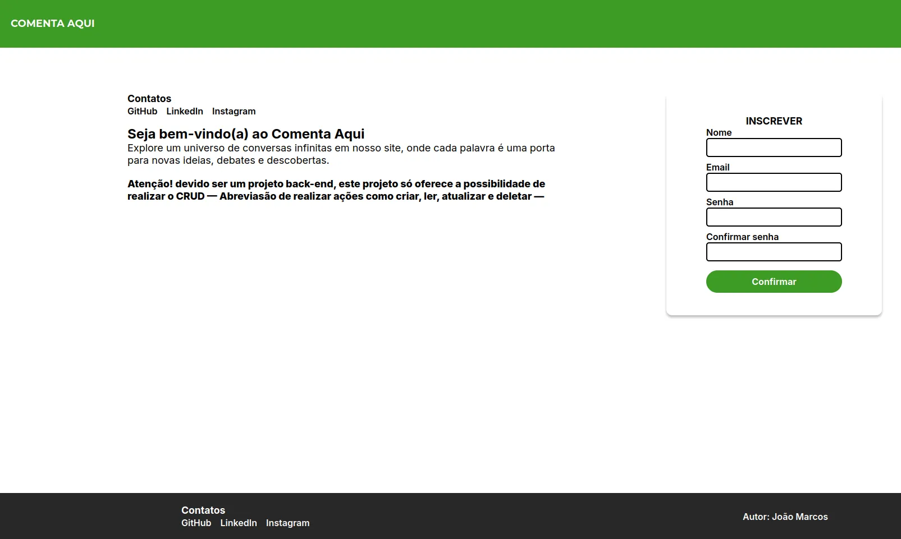

<h1 align="center">Comenta Aqui</h1>

    

## Navegação
- [Sobre](#sobre)
- [Metas a serem cumpridas](#metas-a-serem-cumpridas)
- [Tecnologias Atualmente utilizadas](#tecnologias-atualmente-utilizadas)

## Sobre
O Comenta Aqui é um site fictício, que tem como objetivo ser uma rede social para a conversação

Este é um projeto Full-stack (apresenta tanto a interface (Front-end) e a interação como o servidor Back-end)

### Metas a serem cumpridas
- [ ] Desenvolver o Front-end
    - [ ] Tela de início
    - [ ] Tela principal
    - [ ] Tela de interação
- [ ] Escolher a linguagem para o Back-end
- [ ] Escolher um Banco de Dados

### Tecnologias Atualmente utilizadas
- HTML, CSS JavaScript (Front-end)
- NodeJs (Back-end, mas posso mudar de tecnologia)
